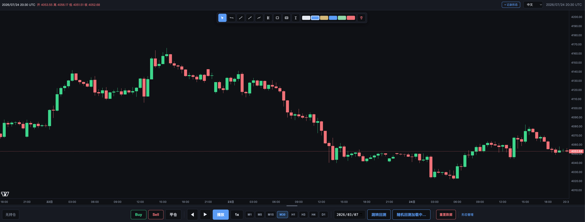
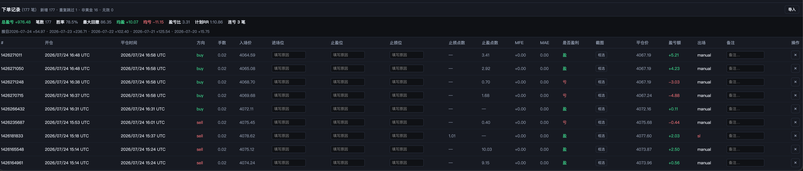
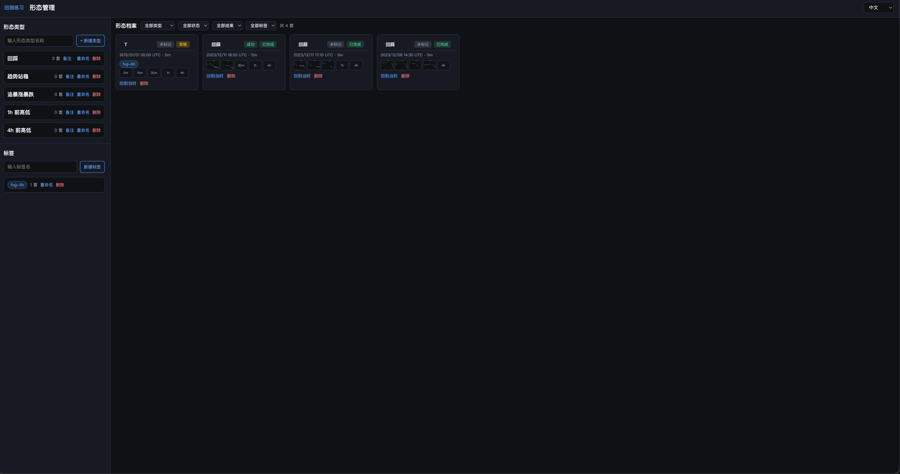
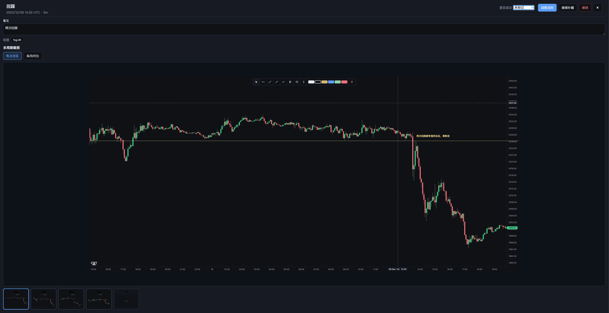

# 回测练习工具

基于本地 `Files/` 行情的 **XAUUSD K 线回放练习台**：在浏览器中推进历史 K 线、模拟开平仓（SL/TP）、画线标注，并把形态与成交记录沉淀成可复盘的档案。

仓库已包含行情数据，clone 后即可启动。界面支持中 / 英切换。

**k线数据来源 Exness 平台，[低点差，注册](https://one.exnessonelink.com/a/4yijxy0m15)**

---

## 目录

- [功能一览](#功能一览)
- [环境要求](#环境要求)
- [快速开始](#快速开始)
- [界面导览](#界面导览)
- [回放与练习](#回放与练习)
- [模拟下单](#模拟下单)
- [画线工具](#画线工具)
- [下单记录与 CSV 导入](#下单记录与-csv-导入)
- [形态档案](#形态档案)
- [快捷键](#快捷键)
- [配置说明](#配置说明)
- [更新 / 合并行情](#更新--合并行情)
- [macOS 桌面打包](#macos-桌面打包)
- [目录结构](#目录结构)
- [本地数据与隐私](#本地数据与隐私)
- [API 摘要](#api-摘要)
- [常见问题](#常见问题)

---

## 功能一览

| 能力 | 说明 |
|------|------|
| K 线回放 | 多周期（ 5m / 15m / 30m / 1h / 4h / 1d），播放 / 单步 / 变速 |
| 练习起点 | 跳转日期、随机开始、跳到最新 |
| 模拟交易 | Buy / Sell，拖动手柄设 SL/TP，回放时按 bar 高低判定 |
| 画线 | 水平线、趋势线、射线、路径、斐波那契、矩形、价格块、文字 |
| 下单记录 | 落盘保存；支持经纪商成交 CSV 导入；点击行在图上开关开单区 |
| 形态档案 | 多周期截图、类型 / 标签、成功失败标记；独立管理页 |
| 桌面版 | 可选打包为 macOS `.app` |

---

### 01 · 回放主界面


### 02 · 模拟开仓



### 03 · 下单记录



### 04 · 形态记录坞



### 05 · 形态档案详情




---

## 环境要求

- Python **3.10+**（推荐）
- 依赖见 [`requirements.txt`](requirements.txt)：`pandas`、`pyyaml`
- 现代浏览器（Chrome / Edge / Safari / Firefox）
- macOS 桌面打包另需 [`requirements-desktop.txt`](requirements-desktop.txt)（`pywebview`、`pyinstaller`）

---

## 快速开始

```bash
git clone https://github.com/Aceysx/xauusd-replay-practice.git
cd re-test
pip install -r requirements.txt
python3 -m src.server.replay_server
```

终端会打印实际端口。默认：

- 地址：`http://127.0.0.1:8765/`
- 若 8765 占用，会依次尝试 **8766–8769**

打开后应能直接看到 `Files/` 中的 XAUUSD K 线。形态管理页：`http://127.0.0.1:8765/patterns.html`。

---

## 界面导览

页面大致分为四块：

1. **顶栏**：当前 bar 信息、语言切换、播放时间；记录形态时出现形态坞  
2. **图表区**：K 线 + 左侧浮动画线工具栏 + 画线 / RR / 开单区叠加层  
3. **中间拖拽条**：上下调整下方面板高度  
4. **下方面板**：持仓信息、交易与回放按钮、周期切换、日期跳转、下单记录表  

右上角语言下拉可切换中文 / English。

---

## 回放与练习

### 默认行为

- 首次打开加载最近约 **30 个交易日**（`config.yaml` → `replay.initial_trading_days`）
- 默认停在数据中的 **最新 K 线**
- 图表一次约绘制 **800** 根可见 K 线（`chart_visible_bars`）；向更早滚动时会按块继续加载

### 控制

| 操作 | 作用 |
|------|------|
| ◀ / ▶ | 单步后退 / 前进一根 K 线 |
| 播放 | 自动向前推演；再点暂停 |
| 速度按钮（1x…） | 循环切换回放速度 |
| 周期条 | 切换 1m / 5m / 15m / 30m / 1h / 4h / 1d |
| 日期 + 跳转回测 | 跳到指定交易日开始练习 |
| 随机开始 | 随机选一个仍有足够向前空间的起点 |
| 重置数据 | 清空本地练习状态（画线 / 练习缓存等，按提示确认） |

回放推进时，**只会看到「当前时刻」及之前的 K 线**，便于做盲测练习。

---

## 模拟下单

1. 在合适位置点 **Buy** / **Sell**（或快捷键 `B` / `S`）  
2. 图表出现入场价与 **SL / TP 手柄**；拖动调整点数（默认见配置 `strategy.default_sl` / `default_tp`）  
3. 继续单步或播放：按每根 bar 的高/低价判定是否触及  
4. **平仓**（或 `C`）可手动了结；触及 SL/TP 会自动平仓并写入下单记录  

规则要点：

- 盈亏在浏览器内按点值与手数估算（练习用途）  
- **同一根 K 线同时触及 SL 与 TP 时，按先 SL 处理**  
- 平仓后可在表格里填进场位 / 止盈止损理由、备注，并框选截图  

---

## 画线工具

图表左侧工具栏（也可用快捷键，见下表）：

| 工具 | 说明 |
|------|------|
| 选择 | 选中、拖动编辑已有画线 |
| 水平线 | 含十字辅助线 |
| 趋势线 | 两点 |
| 射线 | 锚点 + 方向，单向延伸；**按住 Shift** 可水平 / 垂直吸附 |
| 路径 | 多点连线；**Enter** 或右键结束 |
| 斐波那契 | 两点 |
| 矩形 | 拖拽画出 |
| 价格块 | 类似开单区的上下价带，带价格标签 |
| 文字 | 点击后输入 |
| 颜色 | 调色板切换当前画线颜色 |
| 清除 | 删除全部画线 |

编辑提示：`Esc` 取消草稿或退回选择工具；选中后 `Delete` / `Backspace` 删除；画线会随练习状态本地保存。

---

## 下单记录与 CSV 导入

面板「下单记录」列出本会话与历史成交（服务端写入 `order_records.json`）。

### 图表联动

- **点击某一行**：在图表上显示 / 隐藏该笔的开单区块（入场、SL、TP）  
- 导入的成交默认不显示区块，需点击行打开  

### 导入经纪商 CSV

点 **导入**，选择成交导出文件。仅保留 **XAUUSD / XAUUSDM**；重复 ticket 会跳过。

需要至少包含这些列（表头不区分大小写）：

```text
ticket,opening_time_utc,closing_time_utc,type,symbol,opening_price,closing_price
```

可选列：`lots`、`profit`、`stop_loss`、`take_profit`、`close_reason`（`sl` / `tp` / 其它视为手动）。

时间请为 **UTC**（例如 `2026-07-19T10:15:00Z` 或常见 ISO 形式）。

导入结果提示示例：`新增 N · 重复跳过 … · 非黄金 … · 无效 …`。

---

## 形态档案

用于把「当时看到的结构」固定成可检索案例。

### 在回放页记录

1. 工具栏旁进入形态流程（**记录形态** / 形态坞）  
2. 选择或新建 **形态类型**，可打 **标签**  
3. **捕获当前图** 或 **框选截图**，可切换周期后多次捕获（多周期帧）  
4. **封存** 结束本条档案；可标记成功 / 失败，写备注  

### 形态管理页

打开 [`/patterns.html`](http://127.0.0.1:8765/patterns.html)：

- 左侧：形态类型、标签（新建 / 重命名 / 备注 / 删除）  
- 右侧：档案列表，按类型 / 标签 / 结果筛选  
- 点开详情：多周期大图浏览、纵向对比、全屏查看  

数据保存在仓库根目录的 `pattern_cases.json` 与 `pattern_screenshots/`（已 gitignore）。

---

## 快捷键

在输入框中打字时快捷键不会触发。

### 回放 / 交易

| 键 | 功能 |
|----|------|
| `Space` | 播放 / 暂停 |
| `←` / `→` | 上一根 / 下一根 |
| `B` | Buy |
| `S` | Sell |
| `C` | 平仓 |
| `L` | 跳到最新 |

### 画线

| 键 | 工具 |
|----|------|
| `V` / `1` | 选择 |
| `H` / `2` | 水平线 |
| `T` / `3` | 趋势线 |
| `P` / `4` | 路径 |
| `F` / `5` | 斐波那契 |
| `R` / `6` | 矩形 |
| `A` / `7` | 文字 |
| `Y` / `8` | 射线 |
| `Z` / `9` | 价格块 |
| `Esc` | 取消 / 回选择 |
| `Shift`（画射线时） | 水平或垂直吸附 |
| `Enter` | 结束路径；或编辑选中文字 |
| `Delete` / `Backspace` | 删除选中画线 |

---

## 配置说明

主配置：[`config.yaml`](config.yaml)。

```yaml
paths:
  m5_dir: Files
  m5_glob: "xauusd_xauusdm_m5_{date}.csv"
  # 以及 m1 / m15 / m30 / h1 / h4 / d1 的 glob

timezone:
  broker_utc_offset_hours: 3   # 合并经纪商导出时可选
  m5_timezone: UTC             # Files 内时间按 UTC

strategy:
  default_sl: 5                # 模拟单默认止损点数
  default_tp: 20

replay:
  port: 8765
  chart_visible_bars: 800
  initial_trading_days: 30
  default_timeframe: 5m
  bar_ms_per_candle_at_1x: 300
  random_backtest_min_forward_days: 10

server:
  host: "127.0.0.1"
```

改端口或加载天数后重启 `replay_server` 即可。

---

## 更新 / 合并行情

`Files/` 为按日拆分的 OHLC CSV，命名需与 `config.yaml` 中 glob 一致，例如：

```text
Files/xauusd_xauusdm_m5_2026-07-24.csv
```

### 从 MT5 导出合并 M5

```bash
# 默认读取 ~/Downloads/XAUUSD5.csv
python3 scripts/merge_m5_csv.py

# 指定文件，并重建更高周期
python3 scripts/merge_m5_csv.py /path/to/export.csv --rebuild-tf

# 导出若是经纪商时区，减去偏移（小时）
python3 scripts/merge_m5_csv.py export.csv --broker-offset 3 --rebuild-tf

# 只统计不写盘
python3 scripts/merge_m5_csv.py export.csv --dry-run
```

仅重建更高周期（已有 M5 时）：

```bash
python3 scripts/build_timeframe_csvs.py
```

合并时重复时间戳默认保留 **新数据**（`--keep last`）。

---

## macOS 桌面打包

```bash
pip install -r requirements-desktop.txt
./scripts/build_mac.sh          # 当前机器架构（Apple Silicon → arm64）
./scripts/build_mac.sh intel    # Intel → dist/ReplayPractice-intel.app
./scripts/build_mac.sh all      # 同时打 arm64 与 Intel
```

产物位于 `dist/`。在 Apple Silicon 上打 Intel 包通常需要 Rosetta 与 x86_64 Python，详见 `scripts/build_mac.sh` 头部说明。

---

## 目录结构

```text
re-test/
├── Files/                 # 行情 CSV（入库，clone 即有数据）
├── web/                   # 回放页、形态页、样式与前端逻辑
├── src/
│   ├── core/              # 配置、加载、时区
│   ├── engine/            # 练习用模拟计算
│   ├── server/            # HTTP：bars、订单、形态
│   └── app/               # macOS 桌面壳
├── scripts/
│   ├── merge_m5_csv.py
│   ├── build_timeframe_csvs.py
│   └── build_mac*.sh
├── packaging/             # PyInstaller
├── docs/screenshots/      # README 截图（先占位，后换真图）
├── config.yaml
├── requirements.txt
└── README.md
```

---

## 本地数据与隐私

以下文件 / 目录由本地使用生成，**已在 `.gitignore` 中忽略，请勿提交**：

| 路径 | 内容 |
|------|------|
| `order_records.json` | 下单记录 |
| `pattern_cases.json` | 形态档案元数据 |
| `pattern_screenshots/` | 形态截图 |
| `practice_screenshots/` | 订单相关截图 |
| `Statement.htm` 等 | 可选对账单 |
| `dist/`、`build/`、各类 `.venv*` | 构建与虚拟环境 |

浏览器还会在 `localStorage` 中保存部分练习 UI 状态；「重置数据」可清理练习相关缓存。

---

## API 摘要

服务仅监听本机（默认 `127.0.0.1`），供前端使用。

| 端点 | 说明 |
|------|------|
| `GET /api/config` | 配置、日期范围、功能开关 |
| `GET /api/bars?start=&end=&tf=` | OHLC（时间为 UTC unix） |
| `GET` / `PUT` / `DELETE /api/orders` | 下单记录持久化 |
| `/api/patterns*` | 形态档案 CRUD |
| `/api/pattern-types*` | 形态类型 |
| `/api/pattern-tags*` | 标签 |
| `/api/practice/screenshot/...` | 练习截图读写 |

---

## 常见问题

**Q: 打开后没有 K 线？**  
确认 `Files/` 下存在与 `*_glob` 匹配的 CSV，且 `python3 -m src.server.replay_server` 无报错。可看终端是否打印到正确端口。

**Q: 时间和券商软件对不上？**  
本仓库 `Files/` 与图表按 **UTC** 显示。导入成交 CSV 请使用 UTC 时间列；合并 MT5 导出时用 `--broker-offset` 对齐。

**Q: 导入 CSV 提示缺少列？**  
表头必须含 `ticket`、`opening_time_utc`、`closing_time_utc`、`type`、`symbol`、`opening_price`、`closing_price`。非黄金品种会被跳过。

**Q: 形态 / 订单重启后还在吗？**  
在：订单与形态写在仓库根目录的 JSON / 截图目录。不要误删；也不会进 git。

**Q: 可以用于实盘下单吗？**  
不可以。本工具只做本地回放与复盘练习，不连接交易账户。

---

## License

若仓库未单独声明许可证，默认仅供个人学习与练习使用。需要开源协议时可自行补充 `LICENSE`。
